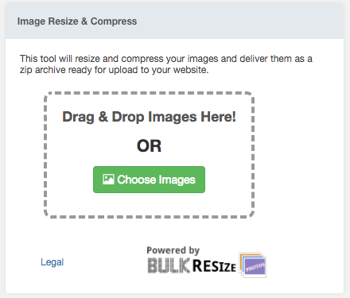

# MODX Dashboard Widgets

HTML widgets for use on a MODX dashboard. The "Widget Content" is listed below.

Each widget embeds an iframe that loads static HTML hosted in this repo using GitHub pages.

## Bulk Resize Widget

A client size image resize and optimisation tool using https://bulkresizephotos.com/embed with configurable options tied to MODX system settings.

### Additional System Settings Required:

`[[++bulkresizeq]]` The quality to use for JPEG compressions.

`[[++bulkresizew]]` The pixel length of the longest side of the output image.

### Widget Content

```<iframe width="400" height="300" style="max-width:100%;" scrolling="no" src="https://dashmedia.github.io/modx-dashboard-widgets/bulkresize.html?bulkresizew=[[++bulkresizew]]&bulkresizeq=[[++bulkresizeq]]" frameborder="0" allowfullscreen></iframe>```

### Screenshot


